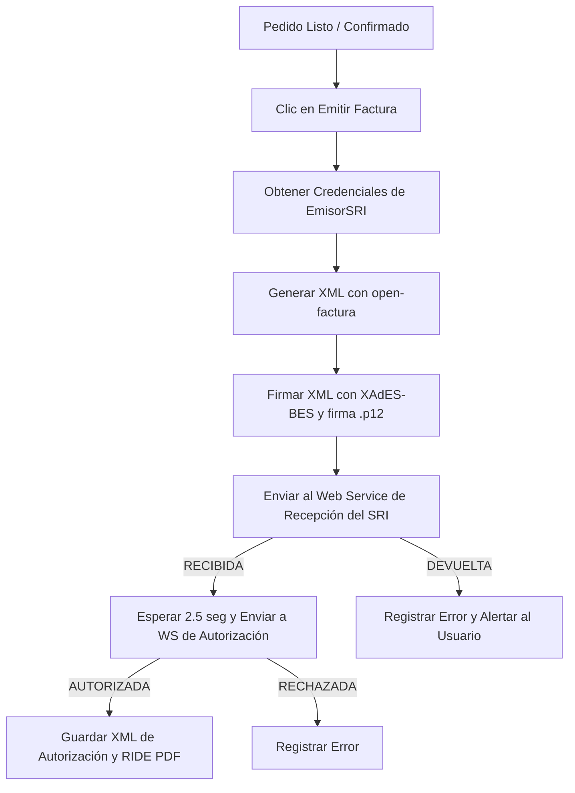

# Facturación Electrónica SRI (Ecuador)

Este módulo implementa el flujo oficial de emisión y autorización de comprobantes electrónicos del SRI (Ecuador) de forma 100% nativa.

## Arquitectura y Flujo

## Requisitos y Configuración

El usuario debe acceder a **Configuración > Facturación SRI** y subir su firma `.p12`, ingresar su clave y completar los campos del Ruc, Razón Social, Dirección, Establecimiento (`001`), Punto de Emisión (`001`), y el tipo de Ambiente (Pruebas o Producción).

### Archivos de Almacenamiento Seguro
- **Firma electrónica**: Guardada en local en `storage/sri/firma.p12`.
- **XMLs Autorizados**: Guardados en el campo `xmlFirmado` en la tabla `facturas_sri` de MySQL.
